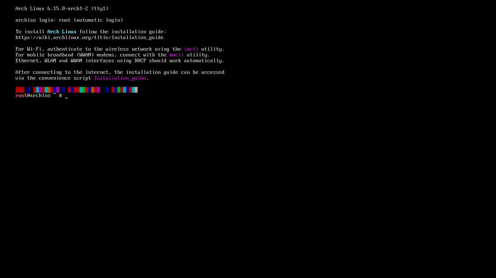

# Installation Steps

## Creating a Bootable USB

1. Download latest Arch Linux ISO file and checksum file like Sha256sums.txt from a closer mirror

**Download Page**: https://archlinux.org/download/

[Download ISO & Checksum File](https://github.com/user-attachments/assets/63b4dbb9-7750-4759-b9ea-dc0cefdd2da7)

2. Check ISO integrity


3. Create a Bootable USB, you can use [balenaEtcher](https://etcher.balena.io/)

  - Plug in and Find your USB

    ```
    ❯ sudo fdisk -l
    Disk /dev/sda: 238.47 GiB, 256060514304 bytes, 500118192 sectors
    Disk model: SM200 2.5 INCH S
    ...

    Disk /dev/sdb: 29.25 GiB, 31406948352 bytes, 61341696 sectors
    Disk model: Cruzer Blade    
    ...
    ```

> [!NOTE]
> Here my USB is `/dev/sdb`

  - Flash it

    ```
    ~$ sudo dd if=archlinux-x86_64.iso of=/dev/sdb bs=4M oflag=direct conv=fsync status=progress
    1333788672 bytes (1.3 GB, 1.2 GiB) copied, 6 s, 218 MB/s
    328+1 records in
    328+1 records out
    1378795520 bytes (1.4 GB, 1.3 GiB) copied, 7.2245 s, 191 MB/s
    ```

## Boot and Install

1. Restart your laptop or computer into `One Time Boot Mode`. For me, this means using the `F12` key during bootup and choosing the Bootable USB. Alternatively, you can use the `F2` key to boot into BIOS settings and alter the boot sequence.

2. Select `Arch Linux install medium (x86_64, UEFI)` and wait till you see this
  

3. If you are not using an Ethernet cable, setup your Wi-Fi like this
  ```
  ~$ iwctl
  NetworkConfigurationEnabled: disabled
  StateDirectory: /var/lib/iwd
  Version: 3.9
  [iwd]# device list 
                                      Devices                                    
  --------------------------------------------------------------------------------
    Name                  Address               Powered     Adapter     Mode      
  --------------------------------------------------------------------------------
    wlan0                 ba:f4:8a:c8:9c:28     on          phy0        station     

  [iwd]# device wlan0 set-property Powered on 
  [iwd]# station wlan0 scan 
  [iwd]# station wlan0 get-networks 
                                Available networks                             *
  --------------------------------------------------------------------------------
        Network name                      Security            Signal
  --------------------------------------------------------------------------------
    >   Redmi 12 5G                       psk                 ****    
        Anshuman                          psk                 ****    
  ```
> [!NOTE]
> Here my Wi-Fi is `Redmi 12 5G`
  ```
  [iwd]# station wlan0 connect "Redmi 12 5G" 
  Type the network passphrase for Redmi 12 5G psk.                                
  Passphrase: ********                                                            
  [iwd]# exit 
  ```
4. Check if you are connected to internet
  ```
  ~$ ping -c 3 google.com
  PING google.com (2404:6800:4002:813::200e) 56 data bytes
  64 bytes from del11s08-in-x0e.1e100.net (2404:6800:4002:813::200e): icmp_seq=1 ttl=116 time=66.4 ms
  64 bytes from del11s08-in-x0e.1e100.net (2404:6800:4002:813::200e): icmp_seq=2 ttl=116 time=75.8 ms
  64 bytes from del11s08-in-x0e.1e100.net (2404:6800:4002:813::200e): icmp_seq=3 ttl=116 time=92.4 ms

  --- google.com ping statistics ---
  3 packets transmitted, 3 received, 0% packet loss, time 2002ms
  rtt min/avg/max/mdev = 66.380/78.165/92.365/10.744 ms
  ~$
  ```
> [!NOTE]
> The lower the packet loss the better
