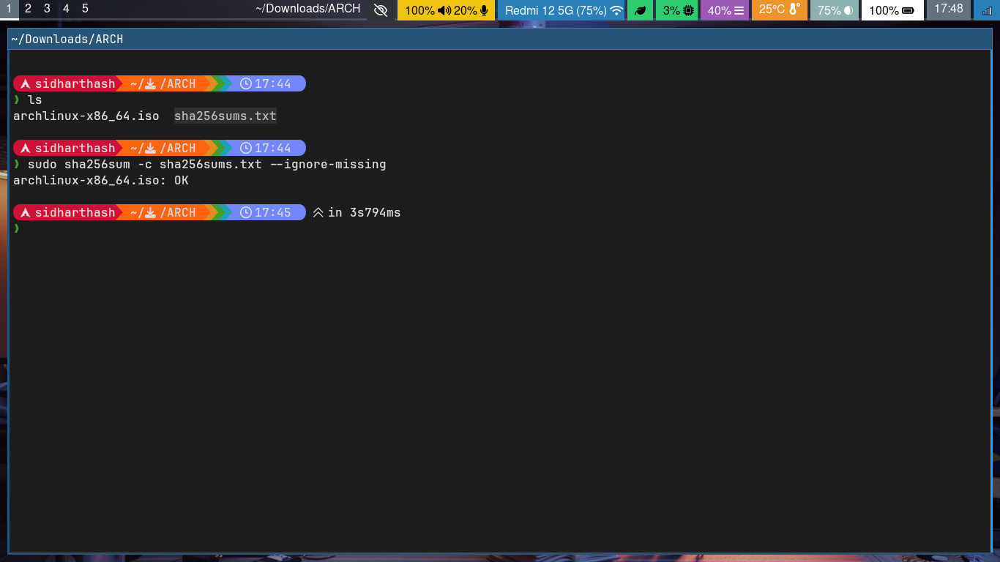

# Installation Steps

## Creating a Bootable USB

1. Download latest Arch Linux ISO file and checksum file like Sha256sums.txt from a closer mirror

**Download Page**: https://archlinux.org/download/

[Download ISO & Checksum File](https://github.com/user-attachments/assets/63b4dbb9-7750-4759-b9ea-dc0cefdd2da7)

2. Check ISO integrity



3. Create a Bootable USB, you can use [balenaEtcher](https://etcher.balena.io/)

  - Plug in and Find your USB
    ```
    ❯ sudo fdisk -l
    Disk /dev/sda: 238.47 GiB, 256060514304 bytes, 500118192 sectors
    Disk model: SM200 2.5 INCH S
    ...

    Disk /dev/sdb: 29.25 GiB, 31406948352 bytes, 61341696 sectors
    Disk model: Cruzer Blade    
    ...
    ```

  > [!NOTE]
  > Here my USB is /dev/sdb

  - Flash it
  ```
  ~$ sudo dd if=archlinux-x86_64.iso of=/dev/sdb bs=4M oflag=direct conv=fsync status=progress
  1333788672 bytes (1.3 GB, 1.2 GiB) copied, 6 s, 218 MB/s
  328+1 records in
  328+1 records out
  1378795520 bytes (1.4 GB, 1.3 GiB) copied, 7.2245 s, 191 MB/s
  ```
